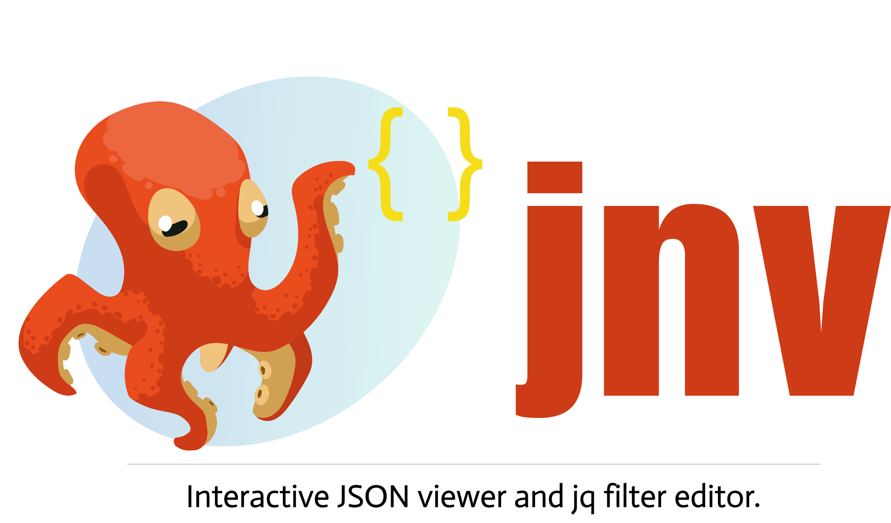

<p align="center">
  <source media="(prefers-color-scheme: dark)" srcset="assets/jnv-dark.svg">
  
</p>

[](https://github.com/ynqa/jnv/actions/workflows/ci.yml)

*jnv* is designed for navigating JSON,
offering an interactive JSON viewer and `jq` filter editor.


Inspired by [jid](https://github.com/simeji/jid)
and [jiq](https://github.com/fiatjaf/jiq).

## Features

- Interactive JSON viewer and `jq` filter editor
  - Syntax highlighting for JSON
  - Use [jaq](https://github.com/01mf02/jaq) to apply `jq` filter
    - This eliminates the need for users to prepare `jq` on their own
- Configurable features via TOML configuration
  - Toggle hint message display
  - Adjust UI reactivity (debounce times and animation speed)
  - Editor appearance and behavior
  - JSON viewer styling
  - Adjust completion feature display and behavior
  - Keybinds
- Capable of accommodating various format
  - Input: File, stdin
  - Data: A JSON or multiple JSON structures
    that can be deserialized with 
    [StreamDeserializer](https://docs.rs/serde_json/latest/serde_json/struct.StreamDeserializer.html),
    such as [JSON Lines](https://jsonlines.org/)
- Auto-completion for the filter
  - Only supports:
    - [Identity](https://jqlang.github.io/jq/manual/#identity)
    - [Object Identifier-Index](https://jqlang.github.io/jq/manual/#object-identifier-index)
    - [Array Index](https://jqlang.github.io/jq/manual/#array-index)
- Hint message to evaluate the filter

## Installation

[](https://repology.org/project/jnv/versions)

### Homebrew

See [here](https://formulae.brew.sh/formula/jnv) for more info.

```bash
brew install jnv
```

Or install via Homebrew Tap:

```bash
brew install ynqa/tap/jnv
```

### MacPorts

See [here](https://ports.macports.org/port/jnv/) for more info.

```bash
sudo port install jnv
```

### Nix / NixOS

See [package entry on search.nixos.org](https://search.nixos.org/packages?channel=unstable&query=jnv) for more info.

```bash
nix-shell -p jnv
```

### conda-forge

See [here](https://prefix.dev/channels/conda-forge/packages/jnv) for more info.

```bash
pixi global install jnv
# or
cat data.json | pixi exec jnv
# or
conda install jnv
```

### Docker

Build
(In the near future, the image will be available on something of registries)

```bash
docker build -t jnv .
```

And Run
(The following commad is just an example. Please modify the path to the file you want to mount)

```bash
docker run -it --rm -v $(pwd)/debug.json:/jnv/debug.json jnv /jnv/debug.json
```

### Cargo

```bash
cargo install jnv
```

## Examples

```bash
cat data.json | jnv
# or
jnv data.json
```

## Keymap

| Key | Action |
| :- | :- |
| <kbd>Ctrl + C</kbd> | Exit |
| <kbd>Ctrl + Q</kbd> | Copy jq filter to clipboard |
| <kbd>Ctrl + O</kbd> | Copy JSON to clipboard |
| <kbd>Shift + ↑</kbd>, <kbd>Shift + ↓</kbd> | Switch to another mode |

### Editor mode (default)

| Key | Action |
| :- | :- |
| <kbd>Tab</kbd> | Enter suggestion |
| <kbd>←</kbd> | Move cursor left |
| <kbd>→</kbd> | Move cursor right |
| <kbd>Ctrl + A</kbd> | Move cursor to line start |
| <kbd>Ctrl + E</kbd> | Move cursor to line end |
| <kbd>Backspace</kbd> | Delete character before cursor |
| <kbd>Ctrl + U</kbd> | Clear entire line |
| <kbd>Alt + B</kbd>   | Move the cursor to the previous nearest character within set(`.`,`\|`,`(`,`)`,`[`,`]`) |
| <kbd>Alt + F</kbd>   | Move the cursor to the next nearest character within set(`.`,`\|`,`(`,`)`,`[`,`]`) |
| <kbd>Ctrl + W</kbd>  | Erase to the previous nearest character within set(`.`,`\|`,`(`,`)`,`[`,`]`) |
| <kbd>Alt + D</kbd>   | Erase to the next nearest character within set(`.`,`\|`,`(`,`)`,`[`,`]`) |

#### Suggestion in Editor (after <kbd>Tab</kbd>)

| Key | Action |
| :- | :- |
| <kbd>Tab</kbd>, <kbd>↓</kbd> | Select next suggestion |
| <kbd>↑</kbd> | Select previous suggestion |
| Others | Return to editor |

### JSON viewer mode

| Key | Action |
| :- | :- |
| <kbd>↑</kbd>, <kbd>Ctrl + K</kbd> | Move up |
| <kbd>↓</kbd>, <kbd>Ctrl + J</kbd> | Move down |
| <kbd>Ctrl + H</kbd> | Move to last entry |
| <kbd>Ctrl + L</kbd> | Move to first entry |
| <kbd>Enter</kbd> | Toggle fold |
| <kbd>Ctrl + P</kbd> | Expand all |
| <kbd>Ctrl + N</kbd> | Collapse all |

## Usage

```bash
JSON navigator and interactive filter leveraging jq

Usage: jnv [OPTIONS] [INPUT]

Examples:
- Read from a file:
        jnv data.json

- Read from standard input:
        cat data.json | jnv

Arguments:
  [INPUT]  Optional path to a JSON file. If not provided or if "-" is specified, reads from standard input

Options:
  -c, --config <CONFIG_FILE>             Path to the configuration file.
      --default-filter <DEFAULT_FILTER>  Default jq filter to apply to the input data
  -h, --help                             Print help (see more with '--help')
  -V, --version                          Print version
```

## Configuration

jnv uses a TOML format configuration file to customize various features. 
The configuration file is loaded in the following order of priority:

1. Path specified on the command line (`-c` or `--config` option)
2. Default configuration file path

### Default Configuration File Location

Following the `dirs` crate,
the default configuration file location for each platform is as follows:

- **Linux**: `~/.config/jnv/config.toml`
- **macOS**: `~/Library/Application Support/jnv/config.toml`
- **Windows**: `C:\Users\{Username}\AppData\Roaming\jnv\config.toml`

If the configuration file does not exist,
it will be automatically created on first run.

### Configuration

> [!IMPORTANT]
> The syntax in TOML configurations
> like [default.toml](./default.toml) was revamped in v0.7.0,
> and the configuration shown below reflects the new format.
> A migration tool is not provided for this change.
> Please manually replace/update your local
> `config.toml` to match the new syntax.

> [!WARNING]
> Depending on the type of terminal and environment,
> characters and styles may not be displayed properly.
> Specific key bindings and decorative characters may not
> display or function correctly in certain terminal emulators.

<details>
<summary>The following settings are available in config.toml</summary>

```toml
# Whether to hide hint messages
no_hint = false

# Editor settings
# Uses promkit_widgets::text_editor::Config directly
[editor.on_focus]

# Editor mode
# "Insert": Insert characters at the cursor position
# "Overwrite": Replace characters at the cursor position with new ones
edit_mode = "Insert"

# Characters considered as word boundaries
# These are used to define word movement and deletion behavior in the editor
word_break_chars = [".", "|", "(", ")", "[", "]"]

# Style notation (termcfg)
# Format: "fg=<color>,bg=<color>,ul=<color>,attr=<token|token...>"
# Examples:
# - "fg=blue"
# - "fg=#00FF00,bg=black,attr=bold|underlined"
# - "attr=dim"
#
# Color tokens:
# - reset, black, red, green, yellow, blue, magenta, cyan, white
# - darkgrey, darkred, darkgreen, darkyellow, darkblue, darkmagenta, darkcyan, grey
# - #RRGGBB
#
# Attribute tokens (examples):
# - bold, italic, underlined, dim, reverse, crossedout, nounderline, nobold
#
# Notes:
# - ANSI 256-color index tokens (0..255, e.g. "200") are currently out of notation scope.
# - See termcfg notation reference for full token list.
#
# References:
# - https://github.com/ynqa/termcfg/blob/main/Notations.md
# - https://github.com/ynqa/termcfg

# Prefix shown before the cursor
prefix = "❯❯ "
# Style for the prefix
prefix_style = "fg=blue"
# Style for the character under the cursor
active_char_style = "bg=magenta"
# Style for all other characters
inactive_char_style = ""

# Theme settings when the editor is unfocused
[editor.on_defocus]
# Prefix shown when focus is lost
prefix = "▼ "
# Style for the prefix when unfocused
prefix_style = "fg=blue,attr=dim"
# Style for the character under the cursor when unfocused
active_char_style = "attr=dim"
# Style for all other characters when unfocused
inactive_char_style = "attr=dim"

# JSON display settings
[json]
# Maximum number of JSON objects to read from streams (e.g., JSON Lines format)
# Limits how many objects are processed to reduce memory usage when handling large data streams
# No limit if unset
# max_streams =

# JSON display settings
# Uses promkit_widgets::jsonstream::Config directly
[json.stream]
# Number of spaces to use for indentation
indent = 2
# Style for curly brackets {}
curly_brackets_style = "attr=bold"
# Style for square brackets []
square_brackets_style = "attr=bold"
# Style for JSON keys
key_style = "fg=cyan"
# Style for string values
string_value_style = "fg=green"
# Style for number values
number_value_style = ""
# Style for boolean values
boolean_value_style = ""
# Style for null values
null_value_style = "fg=grey"
# Attribute for the selected row and unselected rows
active_item_attribute = "bold"
# Attribute for unselected rows
inactive_item_attribute = "dim"
# Behavior when JSON content exceeds the available width
# "Wrap": Wrap content to the next line
# "Truncate": Truncate content with an ellipsis (...)
overflow_mode = "Wrap"

# Completion feature settings
[completion]
# Settings for background loading of completion candidates
#
# Number of candidates loaded per chunk for search results
# A larger value displays results faster but uses more memory
search_result_chunk_size = 100

# Number of items loaded per batch during background loading
# A larger value finishes loading sooner but uses more memory temporarily
search_load_chunk_size = 50000

# Completion UI settings
# Uses promkit_widgets::listbox::Config directly
[completion.listbox]
# Number of lines to display for completion candidates
lines = 3
# Cursor character shown before the selected candidate
cursor = "❯ "
# Style for the selected candidate
active_item_style = "fg=grey,bg=yellow"
# Style for unselected candidates
inactive_item_style = "fg=grey"

# Keybinding settings
[keybinds]
# Key to exit the application
exit = ["Ctrl+C"]
# Key to copy the query to the clipboard
copy_query = ["Ctrl+Q"]
# Key to copy the result to the clipboard
copy_result = ["Ctrl+O"]
# Keys to switch focus between editor and JSON viewer
switch_mode = ["Shift+Down", "Shift+Up"]

# Keybindings for editor operations
[keybinds.on_editor]
# Move cursor left
backward = ["Left"]

# Move cursor right
forward = ["Right"]

# Move cursor to beginning of line
move_to_head = ["Ctrl+A"]
# Move cursor to end of line
move_to_tail = ["Ctrl+E"]
# Move cursor to previous word boundary
move_to_previous_nearest = ["Alt+B"]
# Move cursor to next word boundary
move_to_next_nearest = ["Alt+F"]
# Delete character at the cursor
erase = ["Backspace"]

# Delete all input
erase_all = ["Ctrl+U"]

# Delete from cursor to previous word boundary
erase_to_previous_nearest = ["Ctrl+W"]
# Delete from cursor to next word boundary
erase_to_next_nearest = ["Alt+D"]
# Trigger completion
completion = ["Tab"]
# Move up in the completion list
on_completion.up = ["Up"]
# Move down in the completion list
on_completion.down = ["Down", "Tab"]

# Keybindings for JSON viewer operations
[keybinds.on_json_viewer]
# Move up in JSON viewer
up = ["Up", "Ctrl+K"]
# Move down in JSON viewer
down = ["Down", "Ctrl+J"]
# Move to the top of JSON viewer
move_to_head = ["Ctrl+L"]
# Move to the bottom of JSON viewer
move_to_tail = ["Ctrl+H"]
# Toggle expand/collapse of JSON nodes
toggle = ["Enter"]
# Expand all JSON nodes
expand = ["Ctrl+P"]
# Collapse all JSON nodes
collapse = ["Ctrl+N"]

# Application reactivity settings
[reactivity_control]
# Delay before processing query input
# Prevents excessive updates while user is typing
query_debounce_duration = "600ms"

# Delay before redrawing after window resize
# Prevents frequent redraws during continuous resizing
resize_debounce_duration = "200ms"

# Interval for spinner animation updates
# Controls the speed of the loading spinner
spin_duration = "300ms"
```

</details>

## Stargazers over time

[](https://starchart.cc/ynqa/jnv)
